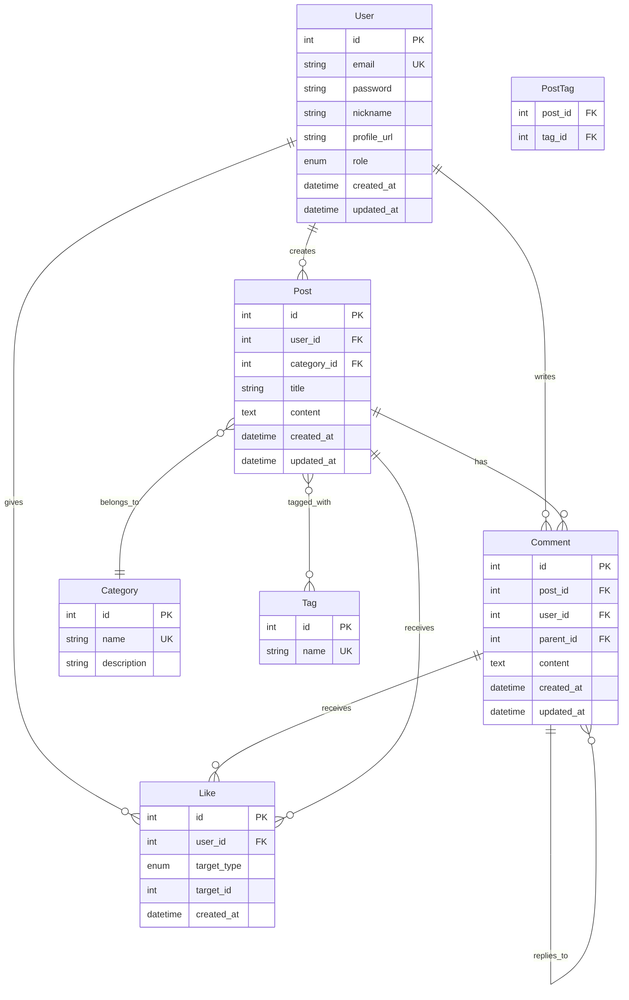

# 설계 문서

## 개요

커뮤니티 게시판 시스템은 Node.js와 MySQL을 기반으로 한 RESTful API 서버입니다. Knex.js를 사용하여 데이터베이스 마이그레이션, 시드 데이터 관리, 쿼리 빌딩을 수행하며, JWT 기반 인증을 통해 사용자 관리를 합니다. 사용자들이 게시글을 작성하고, 댓글을 달고, 좋아요를 누르며 소통할 수 있는 플랫폼을 제공합니다.

## 아키텍처

### 전체 시스템 아키텍처

```
┌─────────────────┐    ┌─────────────────┐    ┌─────────────────┐
│   Client        │    │   API Server    │    │   MySQL         │
│   (Frontend)    │◄──►│   (Fastify)     │◄──►│   (Docker)      │
│                 │    │                 │    │                 │
└─────────────────┘    └─────────────────┘    └─────────────────┘
```

### Docker 환경 구성

```
┌─────────────────────────────────────────────────────────────┐
│                    Docker Compose                           │
├─────────────────────────────────────────────────────────────┤
│  ┌─────────────────┐              ┌─────────────────┐       │
│  │   Node.js App   │              │   MySQL 8.0     │       │
│  │   (Fastify)     │◄────────────►│   Database      │       │
│  │   Port: 3000    │              │   Port: 3306    │       │
│  └─────────────────┘              └─────────────────┘       │
└─────────────────────────────────────────────────────────────┘
```

### 레이어 아키텍처

```
┌─────────────────────────────────────────────────────────────┐
│                     API Layer (Routes)                      │
├─────────────────────────────────────────────────────────────┤
│                   Service Layer (Business Logic)            │
├─────────────────────────────────────────────────────────────┤
│                Repository Layer (Data Access)               │
├─────────────────────────────────────────────────────────────┤
│                    Database Layer (MySQL)                   │
└─────────────────────────────────────────────────────────────┘
```

### 기술 스택

- **Runtime**: Node.js
- **Framework**: Fastify
- **Database**: MySQL 8.0+ (Docker)
- **Containerization**: Docker & Docker Compose
- **Query Builder**: Knex.js
- **Authentication**: JWT (@fastify/jwt)
- **Password Hashing**: bcrypt
- **Validation**: AJV (JSON Schema Validator)
- **Environment**: dotenv
- **Testing**: Jest + Fastify Testing

## 컴포넌트 및 인터페이스

### 프로젝트 구조 (도메인 기반)

```
community-board/
├── docker-compose.yml      # Docker Compose 설정
├── Dockerfile             # Node.js 앱 Docker 설정
├── package.json
├── .env.example
├── .env
├── knexfile.js           # Knex 설정 파일
├── src/
│   ├── config/
│   │   ├── database.js    # Knex 설정
│   │   └── fastify.js     # Fastify 설정
│   ├── domains/
│   │   ├── auth/
│   │   │   ├── controller.js    # 인증 컨트롤러
│   │   │   ├── service.js       # 인증 서비스
│   │   │   ├── routes.js        # 인증 라우트
│   │   │   └── schemas.js       # 인증 스키마
│   │   ├── users/
│   │   │   ├── controller.js    # 사용자 컨트롤러
│   │   │   ├── service.js       # 사용자 서비스
│   │   │   ├── repository.js    # 사용자 리포지토리
│   │   │   ├── model.js         # 사용자 모델
│   │   │   ├── routes.js        # 사용자 라우트
│   │   │   └── schemas.js       # 사용자 스키마
│   │   ├── posts/
│   │   │   ├── controller.js    # 게시글 컨트롤러
│   │   │   ├── service.js       # 게시글 서비스
│   │   │   ├── repository.js    # 게시글 리포지토리
│   │   │   ├── model.js         # 게시글 모델
│   │   │   ├── routes.js        # 게시글 라우트
│   │   │   └── schemas.js       # 게시글 스키마
│   │   ├── comments/
│   │   │   ├── controller.js    # 댓글 컨트롤러
│   │   │   ├── service.js       # 댓글 서비스
│   │   │   ├── repository.js    # 댓글 리포지토리
│   │   │   ├── model.js         # 댓글 모델
│   │   │   ├── routes.js        # 댓글 라우트
│   │   │   └── schemas.js       # 댓글 스키마
│   │   ├── likes/
│   │   │   ├── controller.js    # 좋아요 컨트롤러
│   │   │   ├── service.js       # 좋아요 서비스
│   │   │   ├── repository.js    # 좋아요 리포지토리
│   │   │   ├── model.js         # 좋아요 모델
│   │   │   ├── routes.js        # 좋아요 라우트
│   │   │   └── schemas.js       # 좋아요 스키마
│   │   ├── categories/
│   │   │   ├── service.js       # 카테고리 서비스
│   │   │   ├── repository.js    # 카테고리 리포지토리
│   │   │   ├── model.js         # 카테고리 모델
│   │   │   └── routes.js        # 카테고리 라우트
│   │   └── tags/
│   │       ├── service.js       # 태그 서비스
│   │       ├── repository.js    # 태그 리포지토리
│   │       ├── model.js         # 태그 모델
│   │       └── routes.js        # 태그 라우트
│   ├── plugins/
│   │   ├── auth.js             # JWT 인증 플러그인
│   │   ├── database.js         # 데이터베이스 플러그인
│   │   └── errorHandler.js     # 에러 처리 플러그인
│   ├── migrations/             # Knex 마이그레이션 파일
│   ├── seeds/                  # 시드 데이터 파일
│   ├── shared/
│   │   ├── constants/          # 공통 상수
│   │   ├── utils/              # 유틸리티 함수
│   │   └── types/              # 공통 타입 정의
│   └── app.js                  # Fastify 앱 진입점
└── tests/                      # 테스트 파일
    ├── unit/
    ├── integration/
    └── e2e/
```

### 주요 컴포넌트

#### 1. 인증 시스템 (Authentication System)
- **JWT 토큰 기반 인증** (@fastify/jwt 플러그인)
- **비밀번호 해싱** (bcrypt)
- **토큰 검증 플러그인** (Fastify preHandler)

#### 2. 사용자 관리 (User Management)
- 회원가입/로그인
- 프로필 관리
- 권한 관리 (일반 사용자/관리자)

#### 3. 게시글 시스템 (Post System)
- CRUD 작업
- 카테고리 분류
- 태그 시스템 (Many-to-Many)
- 검색 및 필터링

#### 4. 댓글 시스템 (Comment System)
- 댓글 CRUD
- 대댓글 지원 (1단계 깊이)
- 계층 구조 관리

#### 5. 좋아요 시스템 (Like System)
- 게시글/댓글 좋아요
- 중복 방지
- 좋아요 수 집계

## 데이터 모델

### ERD (Entity Relationship Diagram)



### 데이터베이스 스키마

#### Users 테이블
```sql
CREATE TABLE users (
    id INT PRIMARY KEY AUTO_INCREMENT,
    email VARCHAR(100) UNIQUE NOT NULL,
    password VARCHAR(255) NOT NULL,
    nickname VARCHAR(50) NOT NULL,
    profile_url VARCHAR(255),
    role ENUM('user', 'admin') DEFAULT 'user',
    created_at DATETIME DEFAULT CURRENT_TIMESTAMP,
    updated_at DATETIME DEFAULT CURRENT_TIMESTAMP ON UPDATE CURRENT_TIMESTAMP,
    INDEX idx_email (email),
    INDEX idx_nickname (nickname)
);
```

#### Posts 테이블
```sql
CREATE TABLE posts (
    id INT PRIMARY KEY AUTO_INCREMENT,
    user_id INT NOT NULL,
    category_id INT NOT NULL,
    title VARCHAR(255) NOT NULL,
    content TEXT NOT NULL,
    created_at DATETIME DEFAULT CURRENT_TIMESTAMP,
    updated_at DATETIME DEFAULT CURRENT_TIMESTAMP ON UPDATE CURRENT_TIMESTAMP,
    FOREIGN KEY (user_id) REFERENCES users(id) ON DELETE CASCADE,
    FOREIGN KEY (category_id) REFERENCES categories(id),
    INDEX idx_user_id (user_id),
    INDEX idx_category_id (category_id),
    INDEX idx_created_at (created_at),
    FULLTEXT idx_search (title, content)
);
```

#### Comments 테이블
```sql
CREATE TABLE comments (
    id INT PRIMARY KEY AUTO_INCREMENT,
    post_id INT NOT NULL,
    user_id INT NOT NULL,
    parent_id INT,
    content TEXT NOT NULL,
    created_at DATETIME DEFAULT CURRENT_TIMESTAMP,
    updated_at DATETIME DEFAULT CURRENT_TIMESTAMP ON UPDATE CURRENT_TIMESTAMP,
    FOREIGN KEY (post_id) REFERENCES posts(id) ON DELETE CASCADE,
    FOREIGN KEY (user_id) REFERENCES users(id) ON DELETE CASCADE,
    FOREIGN KEY (parent_id) REFERENCES comments(id) ON DELETE CASCADE,
    INDEX idx_post_id (post_id),
    INDEX idx_user_id (user_id),
    INDEX idx_parent_id (parent_id)
);
```

#### Categories 테이블
```sql
CREATE TABLE categories (
    id INT PRIMARY KEY AUTO_INCREMENT,
    name VARCHAR(50) UNIQUE NOT NULL,
    description TEXT
);
```

#### Tags 테이블
```sql
CREATE TABLE tags (
    id INT PRIMARY KEY AUTO_INCREMENT,
    name VARCHAR(50) UNIQUE NOT NULL
);
```

#### PostTags 테이블 (Many-to-Many)
```sql
CREATE TABLE post_tags (
    post_id INT,
    tag_id INT,
    PRIMARY KEY (post_id, tag_id),
    FOREIGN KEY (post_id) REFERENCES posts(id) ON DELETE CASCADE,
    FOREIGN KEY (tag_id) REFERENCES tags(id) ON DELETE CASCADE
);
```

#### Likes 테이블
```sql
CREATE TABLE likes (
    id INT PRIMARY KEY AUTO_INCREMENT,
    user_id INT NOT NULL,
    target_type ENUM('post', 'comment') NOT NULL,
    target_id INT NOT NULL,
    created_at DATETIME DEFAULT CURRENT_TIMESTAMP,
    FOREIGN KEY (user_id) REFERENCES users(id) ON DELETE CASCADE,
    UNIQUE KEY unique_like (user_id, target_type, target_id),
    INDEX idx_target (target_type, target_id)
);
```

## API 설계

### 인증 API
- `POST /api/auth/register` - 회원가입
- `POST /api/auth/login` - 로그인
- `POST /api/auth/logout` - 로그아웃
- `GET /api/auth/me` - 현재 사용자 정보

### 사용자 API
- `GET /api/users/:id` - 사용자 프로필 조회
- `PUT /api/users/:id` - 사용자 프로필 수정

### 게시글 API
- `GET /api/posts` - 게시글 목록 조회 (검색, 필터링, 페이지네이션)
- `GET /api/posts/:id` - 게시글 상세 조회
- `POST /api/posts` - 게시글 작성
- `PUT /api/posts/:id` - 게시글 수정
- `DELETE /api/posts/:id` - 게시글 삭제

### 댓글 API
- `GET /api/posts/:postId/comments` - 댓글 목록 조회
- `POST /api/posts/:postId/comments` - 댓글 작성
- `PUT /api/comments/:id` - 댓글 수정
- `DELETE /api/comments/:id` - 댓글 삭제

### 좋아요 API
- `POST /api/likes` - 좋아요 추가
- `DELETE /api/likes` - 좋아요 취소

### 카테고리/태그 API
- `GET /api/categories` - 카테고리 목록
- `GET /api/tags` - 태그 목록

## 에러 처리

### 에러 응답 형식
```json
{
    "success": false,
    "error": {
        "code": "VALIDATION_ERROR",
        "message": "입력 데이터가 유효하지 않습니다.",
        "details": [
            {
                "field": "email",
                "message": "유효한 이메일 주소를 입력해주세요."
            }
        ]
    }
}
```

### 에러 코드 정의
- `VALIDATION_ERROR` - 입력 검증 오류
- `AUTHENTICATION_ERROR` - 인증 오류
- `AUTHORIZATION_ERROR` - 권한 오류
- `NOT_FOUND_ERROR` - 리소스 없음
- `DUPLICATE_ERROR` - 중복 데이터
- `INTERNAL_SERVER_ERROR` - 서버 내부 오류

## Docker 환경 설정

### Docker Compose 구성
```yaml
# docker-compose.yml 예시
version: '3.8'
services:
  mysql:
    image: mysql:8.0
    container_name: community-board-mysql
    environment:
      MYSQL_ROOT_PASSWORD: rootpassword
      MYSQL_DATABASE: community_board
      MYSQL_USER: app_user
      MYSQL_PASSWORD: app_password
    ports:
      - "3306:3306"
    volumes:
      - mysql_data:/var/lib/mysql
      - ./init.sql:/docker-entrypoint-initdb.d/init.sql
    command: --default-authentication-plugin=mysql_native_password

  app:
    build: .
    container_name: community-board-app
    ports:
      - "3000:3000"
    environment:
      NODE_ENV: development
      DB_HOST: mysql
      DB_PORT: 3306
      DB_NAME: community_board
      DB_USER: app_user
      DB_PASSWORD: app_password
    depends_on:
      - mysql
    volumes:
      - .:/app
      - /app/node_modules

volumes:
  mysql_data:
```

### 환경 변수 설정
```bash
# .env 파일 예시
NODE_ENV=development
PORT=3000

# Database
DB_HOST=localhost
DB_PORT=3306
DB_NAME=community_board
DB_USER=app_user
DB_PASSWORD=app_password

# JWT
JWT_SECRET=your-super-secret-jwt-key
JWT_EXPIRES_IN=7d

# Bcrypt
BCRYPT_ROUNDS=12
```

## 테스트 전략

### 테스트 레벨
1. **단위 테스트 (Unit Tests)**
   - Service 레이어 로직 테스트
   - Repository 레이어 데이터 접근 테스트
   - 유틸리티 함수 테스트

2. **통합 테스트 (Integration Tests)**
   - API 엔드포인트 테스트
   - 데이터베이스 연동 테스트 (Docker 테스트 DB 사용)
   - 인증/권한 테스트

3. **E2E 테스트 (End-to-End Tests)**
   - 전체 사용자 플로우 테스트
   - 실제 시나리오 기반 테스트

### 테스트 데이터 관리
- Docker를 통한 테스트용 데이터베이스 분리
- 시드 데이터를 통한 일관된 테스트 환경
- 테스트 후 데이터 정리 (cleanup)
- Docker Compose로 테스트 환경 격리

### 테스트 커버리지 목표
- 코드 커버리지: 80% 이상
- 브랜치 커버리지: 70% 이상
- 핵심 비즈니스 로직: 90% 이상